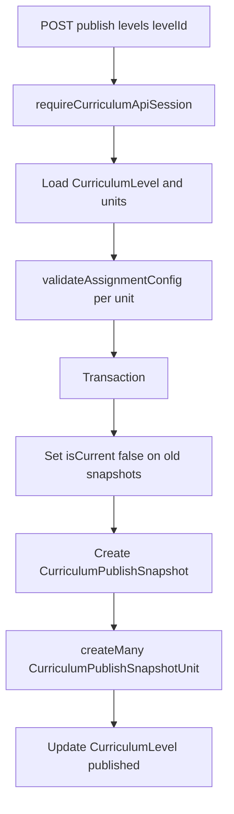

# Curriculum platform logic flow (publish level)

Implements `POST` publish for a level: validates units, bumps snapshot version, marks prior snapshots non-current, writes snapshot rows, sets level to `published`. Source: `apps/curriculum-platform/src/pages/api/publish/levels/[levelId].ts`.

