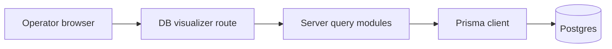

# DB Visualizer logic flow

High-level request path for a typical diagnostics view.

For the **schema graph**, the app may use `$queryRaw` against catalog tables to list columns and foreign-key metadata, then render a graph in the UI.
