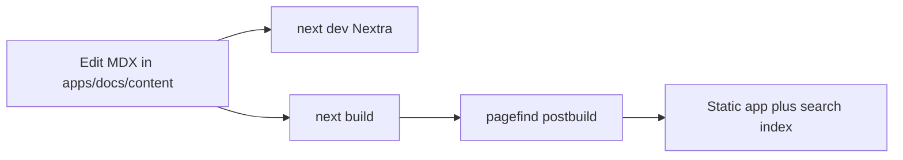

# Ecosystem docs logic flow (build and search)

```mermaid
flowchart LR
  Author[Edit MDX in apps/docs/content]
  Dev[next dev Nextra]
  Build[next build]
  Pagefind[pagefind postbuild]
  Static[Static app plus search index]

  Author --> Dev
  Author --> Build
  Build --> Pagefind
  Pagefind --> Static
```

Scripts live in `apps/docs/package.json` (`build`, `postbuild`).
