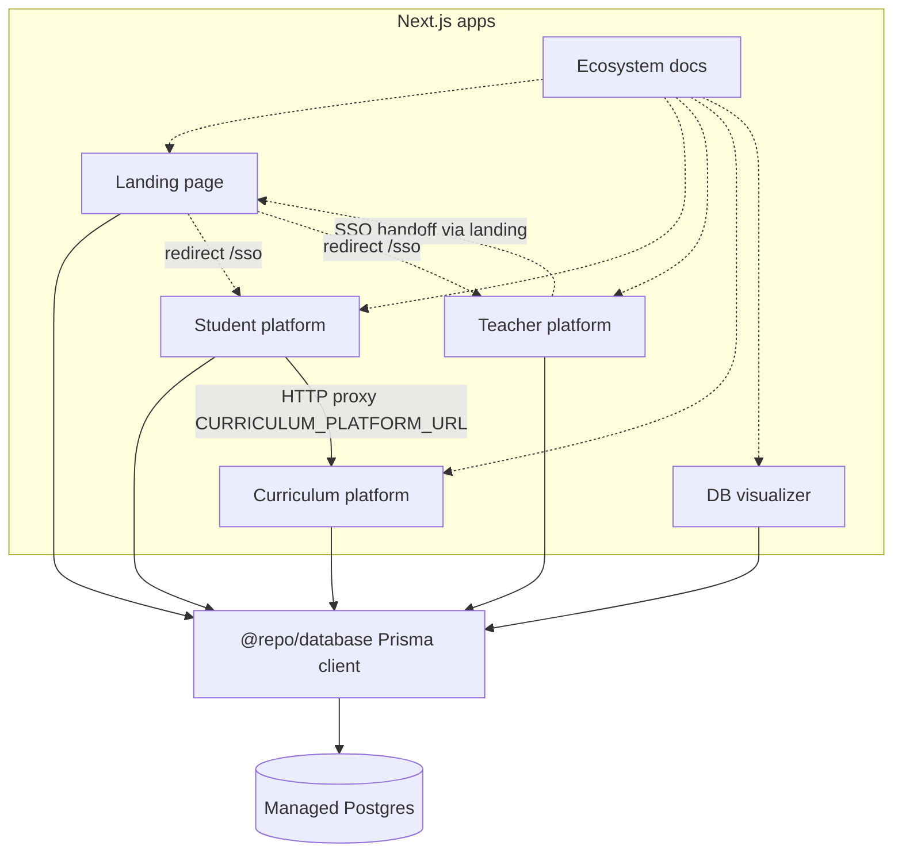

# EFL Explorers ecosystem hub

Connection-first map of the six product surfaces, shared packages, and the database layer. Use the sidebar to open each platform’s **Manifest**, **Connections**, and **Logic flow**.

**Canonical stack:** Approved frameworks and explicit non-goals (including that this ecosystem is **Next.js + React**, not Astro) live in `.cursor/rules/ecosystem.mdc` under **Canonical ecosystem stack**. A short pointer page is [Ecosystem stack](/system/stack).

## Platform spider

Solid lines show primary data or HTTP integration paths. The student app reaches published curriculum through an **HTTP proxy** to the curriculum platform (not Prisma alone).

## Flow summaries

| Flow | Mechanism |
|------|-----------|
| Student consumes lessons / published levels | Browser and API routes call the curriculum app’s public API (`/api/public/levels/...`) via `CURRICULUM_PLATFORM_URL` and optional `x-curriculum-shared-secret`. |
| Teacher tracks progress vs student experience | Operational coupling: shared auth user in `auth.users`, teacher-side `teachers` schema data, student-side APIs; SSO from landing issues tokens consumed on each platform. |
| All Prisma apps | Single schema in `packages/database/prisma/schema.prisma`; runtime connects through `@repo/database` to Postgres. |

## Shared packages

- **`@repo/database`** — Prisma schema, generated client, and pooling helpers. Consumed by landing, student, teacher, curriculum, and db-visualizer apps.
- **`@repo/ui`** — Shared React primitives. Consumed by `@repo/docs` and `landing-page` today.

## Next steps

- [Personality](/personality/zero-assumptions) for agent and contributor rules.
- [Database](/system/database) for schema and deployment notes.
- Each **platform** folder in the sidebar for manifests and integration detail.
