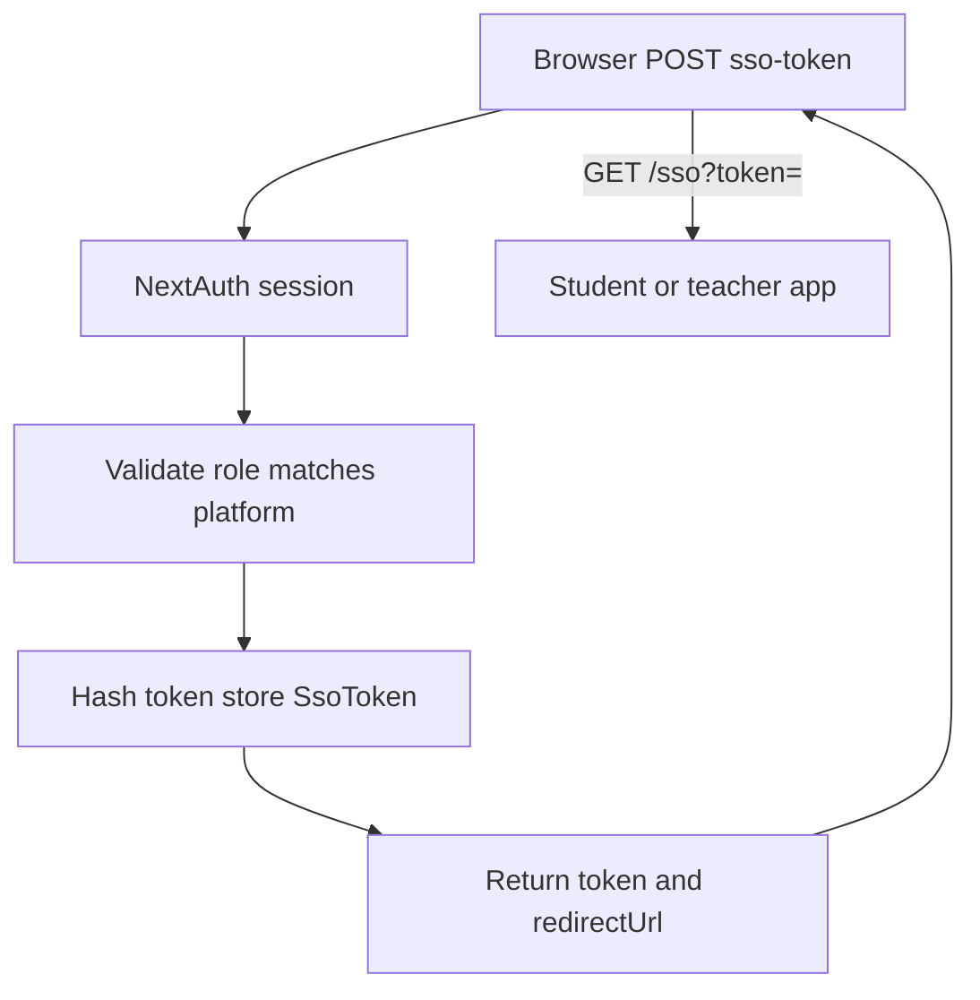

# Landing page logic flow (SSO token)

Flow for issuing a short-lived SSO token and redirecting into a child platform. Implementation reference: `apps/landing-page/src/pages/api/auth/sso-token.ts`.

The plain token is returned once to the client; only a SHA-256 hash is stored in `SsoToken` with `expiresAt` (TTL minutes defined in that route).
