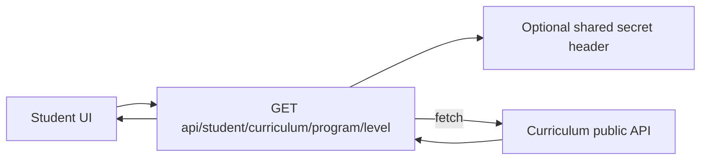

# Student platform logic flow (curriculum proxy)

Published level payload is fetched from the curriculum app, not assembled purely inside the student API from local Prisma models.

Configuration: `CURRICULUM_PLATFORM_URL` and `CURRICULUM_API_SHARED_SECRET` (student `env` module). Handler: `apps/student-platform/src/pages/api/student/curriculum/[programSlug]/[levelSlug].ts`.
