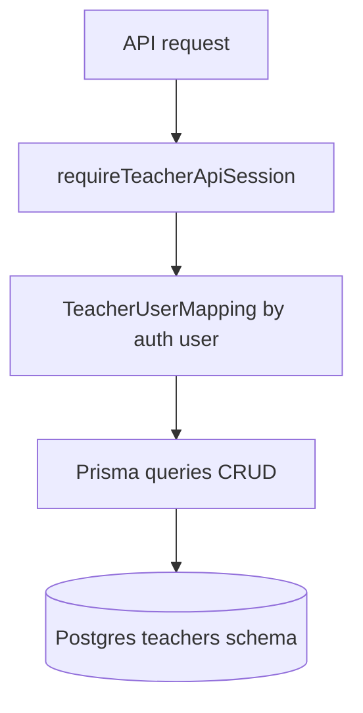

# Teacher platform logic flow (session + storage)

Representative path: authenticated API handler resolves the teacher’s numeric user id from `TeacherUserMapping`, then reads or mutates `teachers` schema rows through the shared Prisma client.

SSO path: `auth.ts` looks up `SsoToken` by hashed token, ties it to `User`, updates `usedAt`, then establishes the app session.
