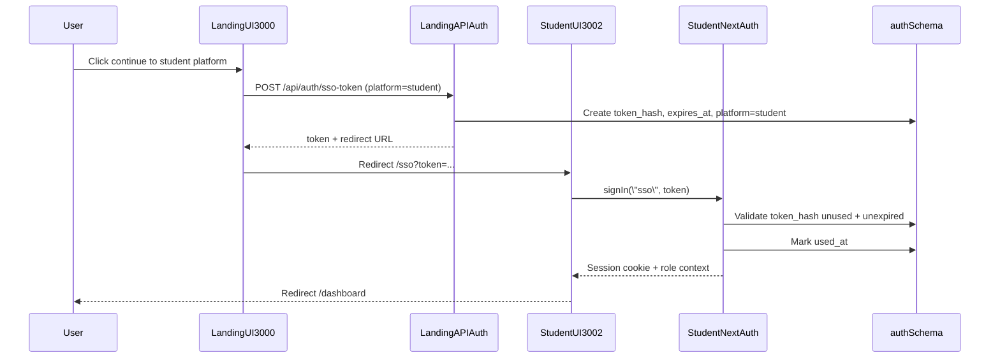

# Student SSO and Session Flow

Defines how student authentication should mirror the secure one-time SSO token
pattern already used for teacher platform access.

## Objectives

- Keep credential auth centralized in landing page.
- Use short-lived, one-time SSO token exchange for student app sign-in.
- Ensure role-safe session materialization in student platform.

## Proposed Sequence

## Validation Rules

- Token hash lookup is exact match using secure hash function.
- Token must satisfy all checks:
  - platform is `student`
  - `used_at` is null
  - `expires_at` is in the future
- Session callbacks include:
  - `user.id`
  - `user.role`
  - `approved` flag when required

## Error Handling

- Missing token in `/sso` route:
  - redirect to landing sign-in
- Invalid/expired/used token:
  - clear transient session state
  - redirect with reason code for UX messaging
- Role mismatch:
  - deny session creation and redirect to landing account chooser

## Security Notes

- Never store plaintext tokens in DB; hash before persistence.
- Always set `used_at` in same transaction as successful validation.
- Token TTL should remain short (recommended 5-10 minutes).
- Log auth events without sensitive token material.

## Reference Docs

- `docs/platforms/teacher-platform/backend/sso.md`
- `docs/platforms/landing-page/backend/sequences.md`
- `packages/database/prisma/schema.prisma`
