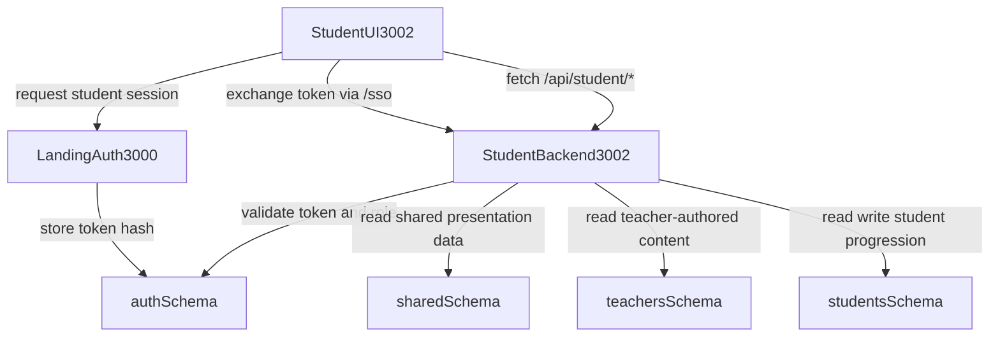

# Runtime Flow Pipeline

Runtime pipeline describes request-by-request behavior across student UI,
student backend, landing auth services, and shared database schemas.

## High-Level Flow

## Request Lifecycle (Protected Student Endpoint)

1. UI sends request with session cookie to `/api/student/*`.
2. Backend resolves session and validates `role = student`.
3. Input query/body is validated with schema parser.
4. Repository layer executes scoped query/mutation.
5. Service layer maps result to DTO and response envelope.
6. Response returns typed `data` + `meta` or structured `error`.

## Caching and Revalidation

- Session-aware responses should avoid shared public caching.
- Dashboard fragments can use short server cache where user-safe.
- Mutation endpoints must invalidate affected summary/progress keys.
- UI revalidates on tab focus for fast-fresh student data.

## Runtime Failure Policy

- Auth failure: return `401`/`403` and trigger re-auth redirect.
- Validation failure: return `400` with field-level details.
- DB transient failure: return `503` with retry guidance.
- Partial dependency read failures: degrade specific widgets only.

## Observability Requirements

- Emit request ID on all responses.
- Track per-endpoint latency and error-code counts.
- Log actor ID, route, and resource identifier for protected operations.
- Capture SSO token exchange failure reasons by category.

## Runtime Dependencies

- Architecture baseline: `docs/architecture.md`
- Operations/env baseline: `docs/operations.md`
- API baseline: `docs/platforms/api-index.md`
- Database schema baseline: `packages/database/prisma/schema.prisma`
