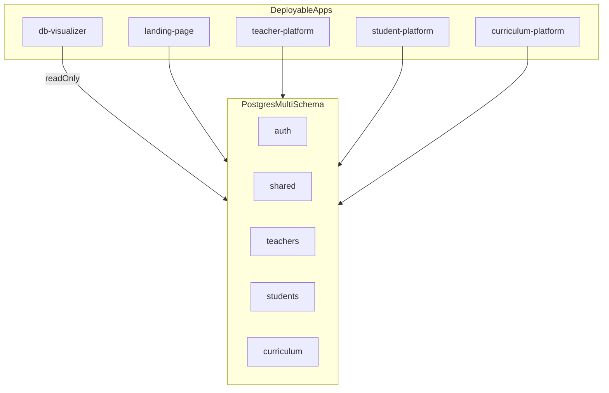

# DB Visualizer: scaling and operating model

This document is the canonical guide for running, securing, and evolving **[`apps/db-visualizer`](../../apps/db-visualizer)** as an internal tool for understanding the EFL Explorers ecosystem. It complements (does not replace) [`maticulus.md`](../maticulus.md), [`architecture.md`](../architecture.md), [`operations.md`](../operations.md), and [`platforms/README.md`](../platforms/README.md).

## Source of truth for schema and tables

**Authoritative database shape:** [`packages/database/prisma/schema.prisma`](../../packages/database/prisma/schema.prisma) (`datasource db.schemas` and each model’s `@@schema(...)`).

[`architecture.md`](../architecture.md) describes high-level domains; details such as the `curriculum` schema, `db-visualizer`, or exact table names can lag. When in doubt, use Prisma or this app’s live panels—not prose alone.

---

## 1. Purpose, audience, non-goals

### Audience

- Core engineers, contractors, and anyone doing **cross-app** or **cross-schema** debugging.
- Operations / incident response when verifying **DB connectivity** and **read access** per schema.

### Goals

- **Orientation:** see how shared content, auth, mappings, curriculum authoring, and loose teaching-side fields relate.
- **Sanity checks:** schema health, identity mapping presence, curriculum snapshot “live” hints, exact-string connectivity between `teachers.Student.level` and `curriculum.CurriculumLevel.slug`.

### Non-goals

- Not a CMS or content editor (read-only).
- No write APIs or mutations from this app.
- Not a full BI / analytics platform; heavy aggregations belong elsewhere.

---

## 2. System map (logical monolith vs deployable apps)

### Logical data platform

- One **PostgreSQL** database with **multiple schemas** (see Prisma file). Applications share the same logical data platform; boundaries are **schema + app code**, not separate databases per app.

### Deployable units

- Multiple **Next.js** apps under `apps/`, typically one **Vercel project** per app (see [`operations.md`](../operations.md) Vercel section).

### Snapshot: apps and primary data touchpoints

| App | Package / path | Primary schemas (typical) | Notes |
|-----|----------------|---------------------------|--------|
| Landing | `apps/landing-page` | `auth`, `shared` | Marketing content, auth hub |
| Teacher | `apps/teacher-platform` | `auth`, `teachers`, often `shared` / curriculum via API | Dashboard, SSO from landing |
| Student | `apps/student-platform` | `auth`, `students`, `teachers` (roster), curriculum via API | Assignments, progress |
| Curriculum | `apps/curriculum-platform` | `auth`, `curriculum` | Authoring, publish snapshots |
| DB Visualizer | `apps/db-visualizer` | **Read-only** across `shared`, `auth`, `students`, `teachers`, `curriculum` | Internal inspection only |

Integration between apps (SSO, curriculum HTTP APIs, public curriculum routes) is documented in platform-specific docs under [`docs/platforms/`](../platforms/).

---

## 3. DB Visualizer architecture in this repo

### User-facing routes (App Router)

- Dashboard shell: [`apps/db-visualizer/src/app/(dashboard)/layout.tsx`](../../apps/db-visualizer/src/app/(dashboard)/layout.tsx) — in-process schema health; **env warning banner** when required URL shapes are missing (`getCriticalEnvIssues` from [`envDiagnostics.ts`](../../apps/db-visualizer/src/lib/envDiagnostics.ts)).
- Sections: `/landing`, `/auth`, `/curriculum`, `/connectivity`, `/schema-map` under [`apps/db-visualizer/src/app/(dashboard)/`](../../apps/db-visualizer/src/app/(dashboard)/)
- **`/deployment`** — standalone layout (no dashboard shell) so operators can open env diagnostics even when Prisma health fails: variable **presence/shape** only (no values), runtime context badges, **`SELECT 1`** probe.
- Legacy query redirect: [`apps/db-visualizer/src/app/page.tsx`](../../apps/db-visualizer/src/app/page.tsx) (`?tab=`, `userId=`)

### HTTP API (live, uncached)

- [`apps/db-visualizer/src/app/api/`](../../apps/db-visualizer/src/app/api/)
  - **`GET /api/efl/internal/sync-all`** — bundled snapshot for the dashboard: landing, auth (`userId` query optional), curriculum, connectivity, health, schema graph; includes `meta.serverQueryMs` and `Server-Timing`. Prefer this for the UI so the browser issues **one** poll on an interval instead of many `/api/*` calls.
  - `GET /api/landing` — pages, sections, content graph, alien-filtered media (legacy / tools)
  - `GET /api/auth?userId=` — user list + mapping bridge
  - `GET /api/curriculum` — programs / levels / units + snapshot summary
  - `GET /api/connectivity` — exact level slug matches
  - `GET /api/health` — per-schema smoke checks
  - `GET /api/deployment-env` — JSON: env report + `databaseReachable` (for monitors; **no secrets** in body)

Route handlers use **`dynamic = "force-dynamic"`** and responses should carry **`Cache-Control: no-store`** so dashboards stay live.

Optional **`EFL_INTERNAL_SYNC_SECRET`**: when set, [`apps/db-visualizer/middleware.ts`](../../apps/db-visualizer/middleware.ts) and the sync-all route require header **`x-efl-internal-sync`**. For in-browser polling, set **`NEXT_PUBLIC_EFL_INTERNAL_SYNC_SECRET`** to the same value (internal deploys only; it is exposed to the client bundle). See [`apps/db-visualizer/.env.local.example`](../../apps/db-visualizer/.env.local.example).

### Server data layer

- Prisma queries: [`apps/db-visualizer/src/server/queries/`](../../apps/db-visualizer/src/server/queries/)
- Bundled snapshot builder: [`apps/db-visualizer/src/server/sync/build-snapshot.ts`](../../apps/db-visualizer/src/server/sync/build-snapshot.ts)
- Shared client: [`@repo/database`](../../packages/database) ([`packages/database.md`](../packages/database.md))

### Resilience to bad or partial JSON

- Normalizers coerce unknown API shapes into safe view models: [`apps/db-visualizer/src/lib/normalize-api-data.ts`](../../apps/db-visualizer/src/lib/normalize-api-data.ts) (re-exported from [`apps/db-visualizer/src/server/normalize-api-data.ts`](../../apps/db-visualizer/src/server/normalize-api-data.ts) for older import paths).
- The dashboard client parses sync-all JSON with strict **meta** Zod validation and flags **schema out-of-sync** (unknown top-level keys or bad `meta`) in the footer without crashing the UI.

### Server-side fetch to own origin

- [`apps/db-visualizer/src/server/api-client.ts`](../../apps/db-visualizer/src/server/api-client.ts) remains available for tools that still call discrete `/api/*` routes from the server. Dashboard sections under `(dashboard)/` consume **`buildDatabaseSyncSnapshot`** (layout) and **`GET /api/efl/internal/sync-all`** (client polling).

---

## 4. Security, compliance, and access model

### Database credentials

- Use a **read-only** database role in **Production** and **Preview** for `DATABASE_URL` (and `DIRECT_URL` if used). Never point the visualizer at migration/admin credentials.
- Env template: [`apps/db-visualizer/.env.local.example`](../../apps/db-visualizer/.env.local.example)

### Application access control (roadmap)

The app does not ship a built-in auth gate. For a public URL, consider:

- Vercel **SSO** / **Password Protection** / edge **Basic Auth**
- **IP allowlist** (enterprise)
- **Shared secret** middleware on all routes (including `/api/*`)

Document whichever option you choose in your internal runbook.

### PII

- **Auth** and **connectivity** views can show **emails**, **names**, and roster fields. Widen access only with policy alignment; consider field redaction in a future phase.

---

## 5. Performance and cost scaling

### Query patterns

- Landing sync loads up to **`LANDING_PAGES_MAX`** pages (with nested sections and content items) and up to **`LANDING_CONTENT_NODES_MAX`** standalone content nodes—raise caps only after measuring payload size and DB load.
- Curriculum loads full program → level → unit trees plus snapshot metadata—watch **payload size** and **TTFB** as units and JSON blobs grow.
- Large JSON: `mediaManifest`, `assignmentConfig`, snapshot payloads—expensive to serialize and transfer.

### Documented limits (current code)

| Area | Limit | Location |
|------|--------|----------|
| Auth user picker | **150** users (`USERS_LIMIT`) | [`auth-mapping.ts`](../../apps/db-visualizer/src/server/queries/auth-mapping.ts) |
| Media assets fetched for alien filter | **150** rows (`take`) | [`landing.ts`](../../apps/db-visualizer/src/server/queries/landing.ts) |
| Landing pages in sync | **500** (`LANDING_PAGES_MAX`) | [`landing.ts`](../../apps/db-visualizer/src/server/queries/landing.ts) |
| Content item nodes in sync | **2500** (`LANDING_CONTENT_NODES_MAX`) | [`landing.ts`](../../apps/db-visualizer/src/server/queries/landing.ts) |
| Connectivity student scan | **5000** (`CONNECTIVITY_STUDENTS_MAX`) | [`connectivity.ts`](../../apps/db-visualizer/src/server/queries/connectivity.ts) |
| Curriculum programs in sync | **200** (`CURRICULUM_PROGRAMS_MAX`) | [`curriculum.ts`](../../apps/db-visualizer/src/server/queries/curriculum.ts) |

### Caching stance

- Today: **always fresh** (`no-store`). Acceptable for internal low-traffic use.
- If curriculum or landing queries become hot: introduce **short TTL** (e.g. 30–60s) or **SWR** at the API layer only after measuring DB load.

### Roadmap (performance)

- Pagination or cursors for users, pages, and units.
- Optional “summary only” API that omits large JSON until expanded.

---

## 6. Reliability and operations

### Health contract: `GET /api/health`

Implementation: [`apps/db-visualizer/src/server/queries/health.ts`](../../apps/db-visualizer/src/server/queries/health.ts)

- Runs lightweight **`findFirst`**-style reads against representative tables per schema:
  - `shared.pages`, `auth.users`, `students.student_user_mappings`, `teachers.students`, `curriculum.levels`
- Returns JSON: `{ checks: [...], summary: { ok, error } }`.
- **Use in uptime monitors** only as a coarse signal (DB up + SELECT granted). It does not validate business rules.

### Common failures

- **SASL / auth errors:** wrong password, SSL params, or pooler vs direct URL—see [PostgreSQL, Prisma, and hosted DB](../operations.md#postgresql-prisma-and-hosted-db-definite-behavior) in [`operations.md`](../operations.md).
- **Permission denied:** read-only role missing `USAGE`/`SELECT` on a schema.

### Deployment correlation

- UI can show **environment**, **region**, and **git commit** (Vercel env vars). If you add new vars consumed at build/runtime for this app, add them to [`turbo.json`](../../turbo.json) `globalEnv` so Turbo cache invalidation stays correct.

---

## 7. Data correctness caveats (read the data, not assumptions)

These are intentional modeling facts in Prisma; the visualizer surfaces them:

1. **`teachers.Student.level`** is a **string**, not a FK to **`curriculum.CurriculumLevel`**. The connectivity view uses **exact string match** to `CurriculumLevel.slug` only.
2. **No `Teacher` profile model** in `teachers` schema as a first-class Prisma model—the auth inspector includes a placeholder where product copy expects a teacher profile.
3. **`StudentUserMapping` / `TeacherUserMapping`** store `authUserId` without a Prisma `@relation` to `auth.User`; bridging is done in application code.
4. **Curriculum “live”** is derived from publish snapshots (`isCurrent` preferred, else latest `publishedAt`)—not a single boolean on every unit row.

When extending the product, treat these as **documentation + UI caveats** until the schema evolves.

### Checklist: adding a new inspected entity

1. Add or reuse a query in `src/server/queries/`.
2. Add `GET /api/...` route with `force-dynamic` + `no-store` (if discrete API is still useful).
3. Extend [`src/lib/normalize-api-data.ts`](../../apps/db-visualizer/src/lib/normalize-api-data.ts) if the payload is new; wire the same shape into [`build-snapshot.ts`](../../apps/db-visualizer/src/server/sync/build-snapshot.ts) and [`parse-sync-snapshot.ts`](../../apps/db-visualizer/src/lib/parse-sync-snapshot.ts) / Zod meta if needed.
4. Add or extend a panel and CSS module under `src/components/`.
5. If rows should appear in the **row preview** grid, extend [`sync-grid-data.ts`](../../apps/db-visualizer/src/lib/sync-grid-data.ts).
6. Update **this doc** and, if needed, [`packages/database.md`](../packages/database.md) or platform ERDs.

---

## 8. Roadmap (phased)

| Phase | Focus |
|-------|--------|
| **P0 (baseline)** | Wireframe UI, live APIs, normalization, `/api/health`, Vercel deploy, read-only DB role |
| **P1** | Auth gate at edge/app, pagination, query budgets, structured logging (request id, per-endpoint latency) |
| **P2** | Deep links to `docs/`, ERD anchors, “explain row” / provenance tooltips |
| **P3** | Read replicas, cached summaries, or export for audits (if compliance requires it) |

---

## 9. Related documentation

- [`docs/README.md`](../README.md) — doc index
- [`docs/packages/database.md`](../packages/database.md) — Prisma package behavior
- [`apps/db-visualizer/.env.local.example`](../../apps/db-visualizer/.env.local.example) — required env vars for the app

---

## Architecture.md consistency

[`docs/architecture.md`](../architecture.md) remains the narrative architecture entrypoint. For **current schema names, models, and apps**, prefer **Prisma** and this document. A short pointer was added at the top of `architecture.md` to reduce drift confusion.
