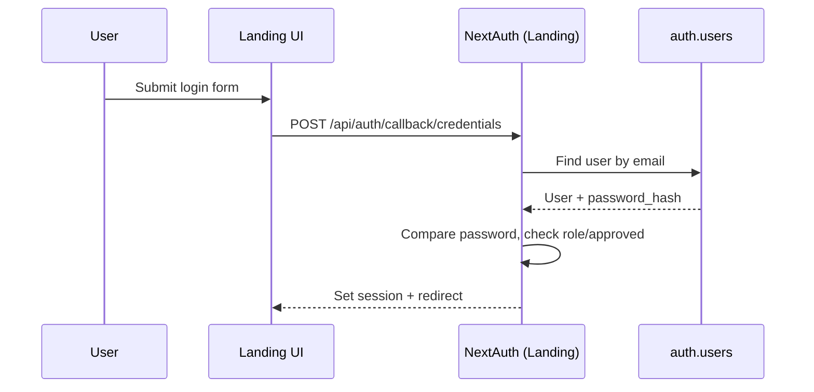
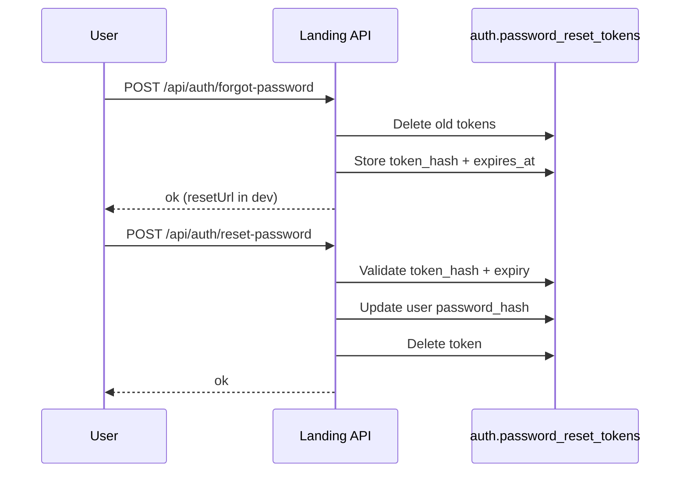
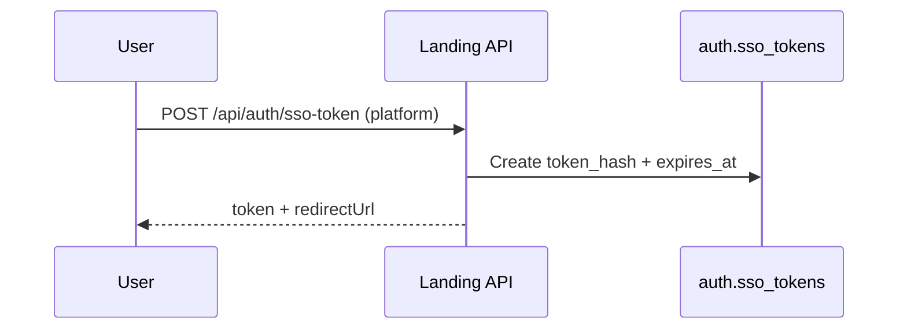

# Landing Page Sequences

## Auth + Session

```mermaid
sequenceDiagram
  participant U as User
  participant UI as Landing UI
  participant API as NextAuth (Landing)
  participant DB as auth.users

  U->>UI: Submit login form
  UI->>API: POST /api/auth/callback/credentials
  API->>DB: Find user by email
  DB-->>API: User + password_hash
  API->>API: Compare password, check role/approved
  API-->>UI: Set session + redirect
```

## Password Reset

```mermaid
sequenceDiagram
  participant U as User
  participant API as Landing API
  participant DB as auth.password_reset_tokens

  U->>API: POST /api/auth/forgot-password
  API->>DB: Delete old tokens
  API->>DB: Store token_hash + expires_at
  API-->>U: ok (resetUrl in dev)
  U->>API: POST /api/auth/reset-password
  API->>DB: Validate token_hash + expiry
  API->>DB: Update user password_hash
  API->>DB: Delete token
  API-->>U: ok
```

## SSO Token Issuance

```mermaid
sequenceDiagram
  participant U as User
  participant API as Landing API
  participant DB as auth.sso_tokens

  U->>API: POST /api/auth/sso-token (platform)
  API->>DB: Create token_hash + expires_at
  API-->>U: token + redirectUrl
```
