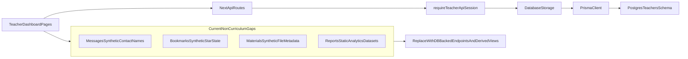

# Teacher Platform Data Integrity Audit (Non-Curriculum)

## Scope

This document tracks all known non-curriculum places where the teacher platform
still uses synthetic, static, or local-only data behavior in runtime UI flows.

- In scope:
  - Messages
  - Bookmarks
  - Materials
  - Reports/analytics
- Out of scope:
  - Curriculum page and curriculum data model changes (tracked separately)

## Goal

Move all in-scope runtime behavior to database-backed APIs so production behavior
is derived from persisted data only.

## Current Runtime Data Path

## Issue Inventory (By Page)

### Messages (`dashboard/messages`)

- Current state:
  - UI uses `currentUserId = 1` client constant for conversation grouping.
  - Contact display names are synthetic (`Sarah Wilson` / `Robert Miller`) based
    on contact id branching.
  - Notification settings are local-only form state with no persistence path.
- Risk:
  - Incorrect identity model if server-side id allocation changes.
  - Incorrect user labeling in production conversations.
  - Preference UX implies persistence but does not save.
- Scale direction:
  - Replace synthetic contact names with directory-backed contact metadata.
  - Provide a server-owned conversation summary endpoint.
  - Add persisted notification preference model and endpoints.

### Bookmarks (`dashboard/bookmarks`)

- Current state:
  - "Starred" behavior is synthetic via `bookmark.id % 3 === 0`.
  - Star/unstar actions are no-op placeholders.
  - "Add Bookmark" / "New Folder" UI actions are incomplete placeholders.
- Risk:
  - User trust issue: starred state is not real or durable.
  - Sorting/filtering semantics differ between sessions and environments.
- Scale direction:
  - Persist bookmark star state in DB.
  - Introduce bookmark mutation endpoints for star/unstar.
  - Define folder model or normalized taxonomy strategy.

### Materials (`dashboard/materials`)

- Current state:
  - File size is synthetic and inferred from extension category.
  - Category-size sorting is based on mock values.
  - Storage usage card is static numbers.
  - Upload/bookmark actions include placeholders and non-persisted behavior.
- Risk:
  - Storage and size metrics are misleading.
  - Operational planning (quota, retention) cannot rely on UI.
  - Material workflows appear complete while key operations are missing.
- Scale direction:
  - Persist material metadata (`sizeBytes`, `mimeType`, `kind`, optional
    dimensions/duration).
  - Derive usage aggregates from persisted metadata.
  - Add upload finalize and bookmark/favorite mutation flows.

### Reports (`dashboard/reports`)

- Current state:
  - Multiple chart datasets are hardcoded static arrays.
  - Some per-row performance fields are synthetic from `student.id` modulo logic.
  - Some attendance details are static date strings.
  - Time period/class filters currently do not drive server-side aggregates.
- Risk:
  - High risk of misleading analytics and wrong interventions.
  - Inability to audit numbers back to source records.
  - Scaling bottleneck as data volume grows.
- Scale direction:
  - Replace static arrays with DB-derived aggregates.
  - Create report read models (or materialized views) for heavy queries.
  - Move filtering and computation to backend API contracts.

## Target-State Principles

- Database is the only source of truth for runtime data.
- UI never fabricates production decision data (scores, trends, ownership,
  contact identity, quotas, usage).
- Empty state is explicit and honest (no generated demo output).
- Ownership and authorization remain server-enforced.
- Data contracts are versioned and test-validated.

## Phased Scale Plan

### Phase 1: Integrity Baseline (Low-risk, immediate)

- Messages:
  - Remove client hardcoded `currentUserId`.
  - Add server response field for `viewerId` and normalized participants.
- Bookmarks:
  - Add explicit `starred` field support (or relation) and expose read/write
    endpoints.
- Materials:
  - Introduce persisted `sizeBytes` and `mimeType` in API response shape.
  - Replace static storage card with a server aggregate endpoint.
- Reports:
  - Remove modulo-based synthetic values from table rows.
  - Render "No analytics data available" if aggregate endpoints are absent.

### Phase 2: Contract Expansion (Medium complexity)

- Add dedicated read endpoints for:
  - Message conversation summaries
  - Bookmark folders/taxonomy and star filters
  - Material usage summary (totals by type and quota)
  - Report metrics by timeframe/class
- Define stable response schemas in shared validation/types.
- Add pagination/cursor support for conversations and material lists.

### Phase 3: Analytics at Scale (Higher complexity)

- Add report aggregate tables or materialized views for:
  - Performance trend series
  - Attendance trend series
  - At-risk detection cohorts
- Introduce refresh strategy:
  - scheduled refresh, event-driven refresh, or hybrid
- Add observability:
  - endpoint latency, cache/mv refresh lag, aggregate freshness timestamps

## API/Data Contract Checklist

### Messages

- Required response shape:
  - participant ids and names from persisted directory source
  - last message metadata
  - unread counts
- Required mutation behavior:
  - create message
  - mark as read
  - conversation list invalidation consistency

### Bookmarks

- Required fields:
  - `id`, `title`, `url`, `category`, `starred`, `createdAt`, `updatedAt`
- Required mutations:
  - create/delete bookmark
  - set/unset starred
  - optional folder assignment mutation

### Materials

- Required fields:
  - `sizeBytes`, `mimeType`, normalized material kind
- Required aggregates:
  - total bytes used
  - bytes by material kind
  - item counts by kind
- Required mutations:
  - upload/register material metadata
  - delete material (and update aggregate correctness)

### Reports

- Required aggregate endpoints:
  - performance distribution
  - attendance distribution and trend
  - per-student computed indicators (server-derived)
- Required query parameters:
  - timeframe
  - class/level
- Required metadata:
  - `generatedAt` or `freshAsOf` timestamps

## Operational Guardrails

- Testing:
  - API integration tests for aggregate correctness and ownership boundaries.
  - UI tests ensuring no synthetic fallbacks are rendered in production paths.
- CI policy:
  - fail on known synthetic patterns in dashboard pages (`id %`, hardcoded
    demo names, new `mock` runtime comments).
- Observability:
  - log and metric coverage for failed aggregate queries and stale report data.
- Rollout:
  - dark launch for new report endpoints.
  - compare old/new report values in parallel before full cutover.

## Definition of Done (Non-Curriculum)

- Messages:
  - no client hardcoded identity assumptions
  - no synthetic contact naming
  - persisted notification preferences implemented or intentionally hidden
- Bookmarks:
  - starred state is persisted and mutation-backed
  - no modulo- or id-derived UI states
- Materials:
  - size and usage derive from persisted metadata/aggregates
  - storage panel reflects real DB-backed values
- Reports:
  - all charts/tables sourced from DB-backed endpoints
  - no static analytics datasets used for runtime decisions

## References

- Policy baseline: `backend/fallback-mock-data-policy.md`
- API surface: `api/README.md`
- Storage behavior: `backend/storage.md`
