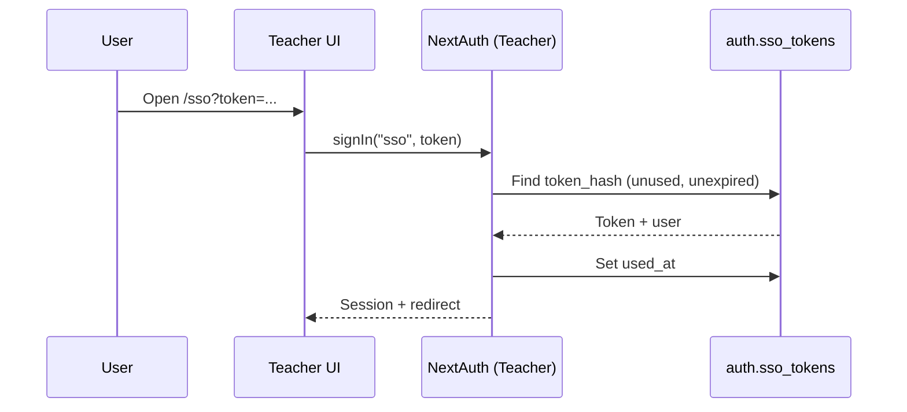

# Teacher Platform SSO

## Auth + SSO

- Uses NextAuth credentials provider (`id: "sso"`).
- Validates SSO tokens issued by the landing page.

## SSO Validation

- Token is hashed with SHA-256 and matched against `auth.sso_tokens`.
- Token must be unused and unexpired.
- On success, `used_at` is set to prevent reuse.

## SSO Login Sequence

